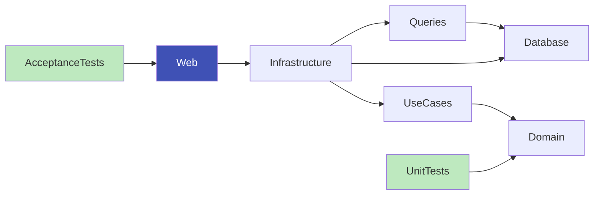

# Unbeatable Tic Tac Toe
This is a .NET application exposing endpoints to play to a Tic tac toe game versus a computer that doesn't want to loose against you!

# Purpose
This is a repository to illustrate an efficient way to develop Web API at a larger scale. This type of architecture and solutions have already been developed and used in a production environment.

It uses some of the top modern designs, such as :
- Clean architecture
- CQRS
- Tactical Domain Driven Design
- Acceptance tests
- etc ...

You'll find useful readmes inside every project's folder to explain noticeable choices, pros, cons and trade-offs.

# Structure

# Disclaimer
Obviously, there are a lot things arguable in this, there are definitively a lot of ways to do this application differently, I don't pretend to have the best and only solution! If you think about better ideas or design, feel free to chat with me! :)

Also, there are quite a lot of things missing such as error handling, authentication / authorization, external services configuration (db, message broker, logging) but it wasn't the purpose of this work, so it has been deliberately omitted.
